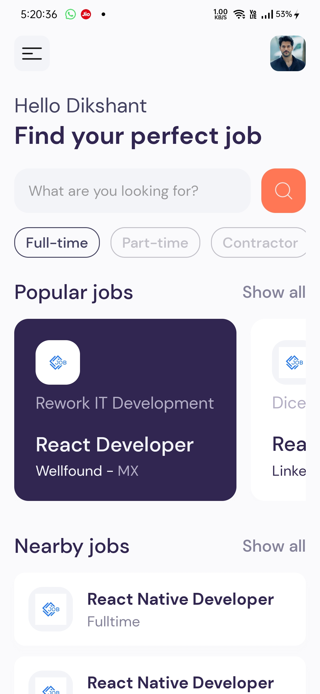
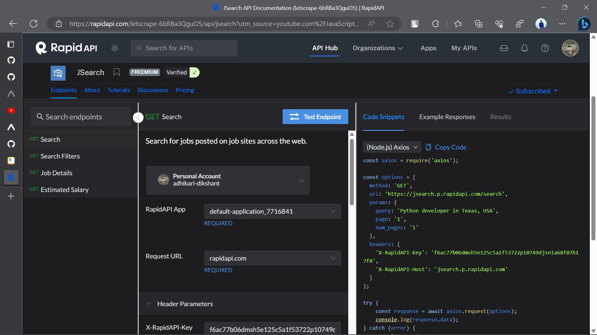
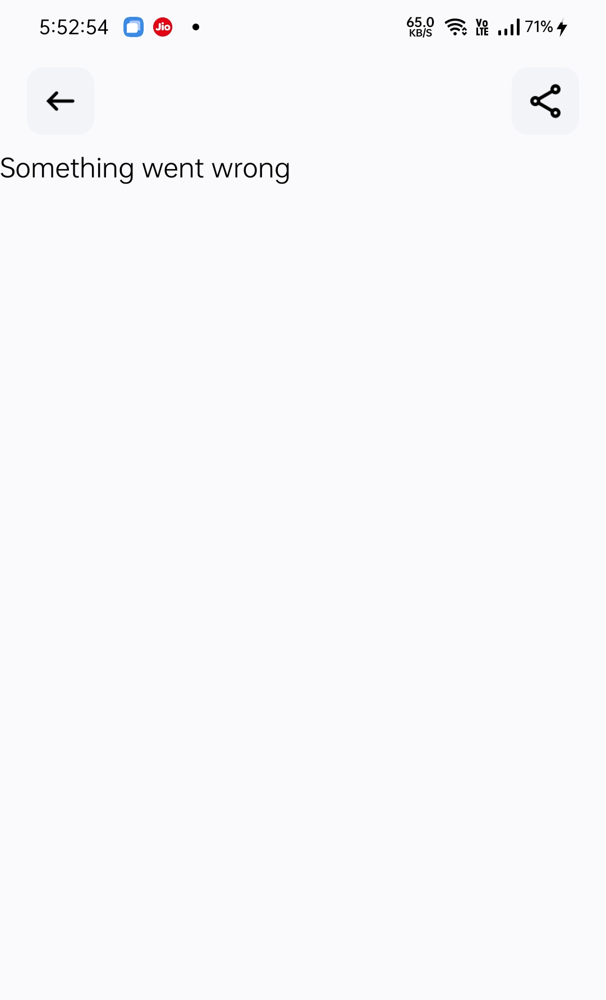
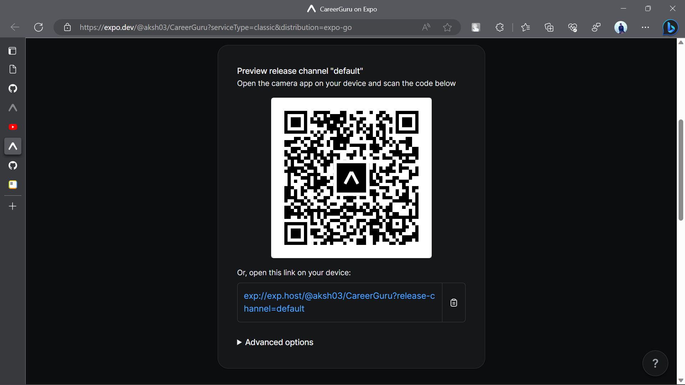
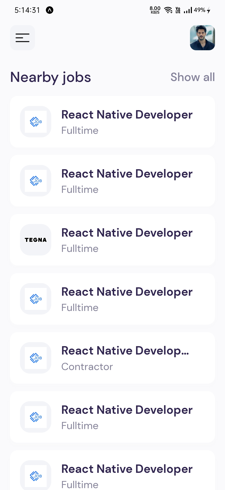

# CareerGuru 
## Find your perfect job


<p align="center">
    
</p>

## :pushpin: How to use this App?

1. Make sure [Git](https://git-scm.com "Git") and [NodeJS](https://nodejs.org "NodeJS") are installed.
2. Clone this repository to your local computer.
3. Type and Run `npm install` or `yarn install` to install required packages.
4. Install **Expo Cli** using `npm i -g expo-cli` or `yarn global add expo-cli` to deploy your app on Expo.
5. Create `.env` file in root directory.
6. Contents of `.env`:
>In React Native, I didn't used `.env` files for storing environment-specific data, such as API keys or configuration settings. This is because the new Rapid API update and React Native didn't supported importing data from `.env` files directly (maybe in this version). Instead, a copy of a configuration file as a reference has been given.

```
RAPID_API_KEY=XXXXXXXXXXXXXXXXXXX
```

7. Now, to setup API, go to [Rapid API Website](https://rapidapi.com/ "Rapid API Website") and create an account.
8. Enable this API to fetch job data: [API: JSearch by OpenWeb Ninja](https://rapidapi.com/letscrape-6bRBa3QguO5/api/jsearch "API: JSearch by OpenWeb Ninja").

 

9. Once project has been set up, you can start this app using `npm start` or `yarn start`.
10. Now app is fully configured and you can start using this app :+1:.

:books: **More Info** related [How to start Expo App](https://www.reactnative.dev/docs/environment-setup "How to start Expo App")

> NOTE: 
> <figcaption align = "center">You might get this error under Error 429. Don't worry it sometimes happens using the free subscribed version. The error might occur indicating the user has sent too many requests in a given amount of time ("rate limiting").</figcaption>

## :pen: Result:
### 1. Install Expo Go (Android) or simply open phone camera (iOS).
### 2. Scan the following QR code for reference.


## :camera: Screenshots
<p align="center">


</p>


## :gear: Built with

[](https://www.javascript.com/ "JavaScript")

[](https://reactjs.org/ "React JS")

[](https://www.reactnative.dev/ "React Native")

[](https://github.com/adhikari-dikshant "Built with Love")

## :raised_hands: Contribute

You might encounter some bugs while using this app. You are more than welcome to contribute. Just submit changes via pull request and I will review them before merging. Make sure you follow community guidelines.


## :star: Give A Star

You can also give this repository a star to show more people and they can use this repository.

## :red_circle: Expo Router Example

Use [`expo-router`](https://expo.github.io/router "expo-router") to build native navigation using files in the `app/` directory.

## :rocket: How to use

```sh
npx create-react-native-app -t with-router
```

## :page_with_curl: Notes

- [Expo Router: Docs](https://expo.github.io/router "Expo Router: Docs")
- [Expo Router: Repo](https://github.com/expo/router "Expo Router: Repo")
- [Request for Comments](https://github.com/expo/router/discussions/1 "Request for Comments")
